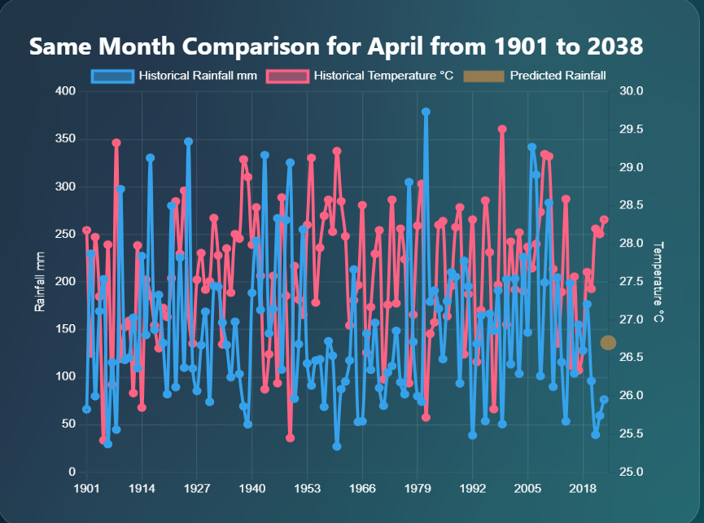
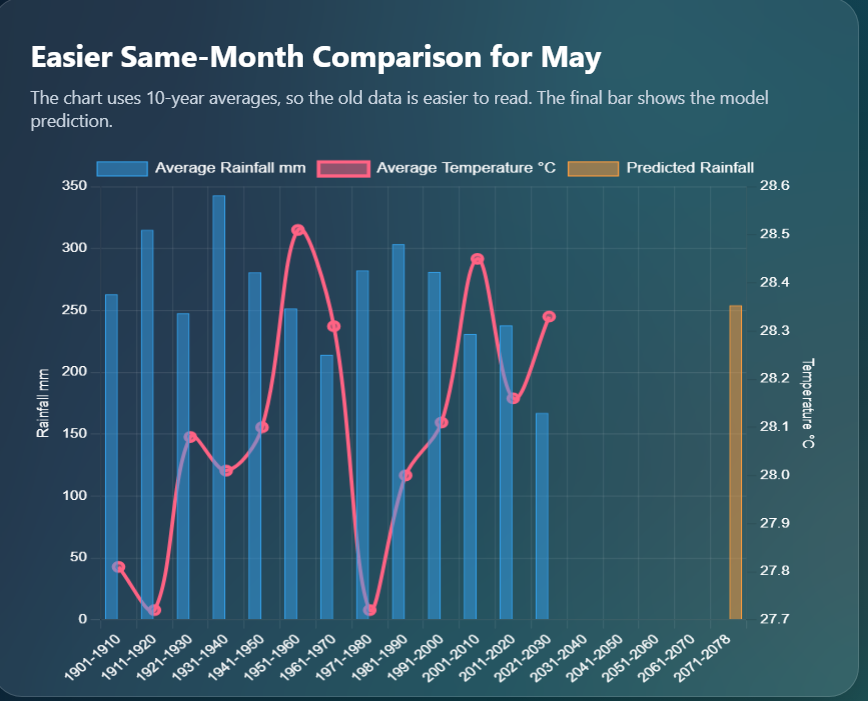
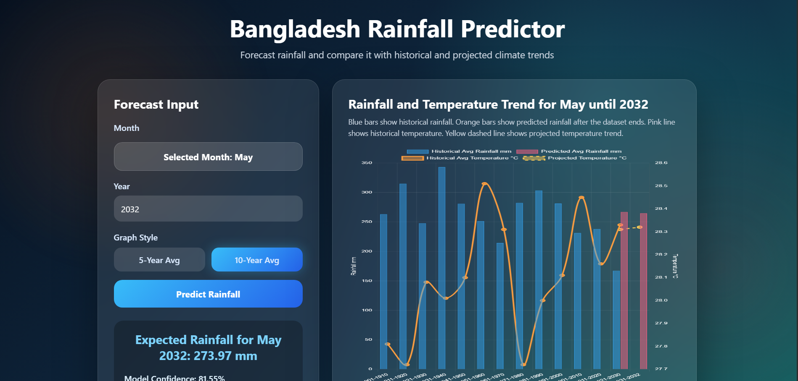
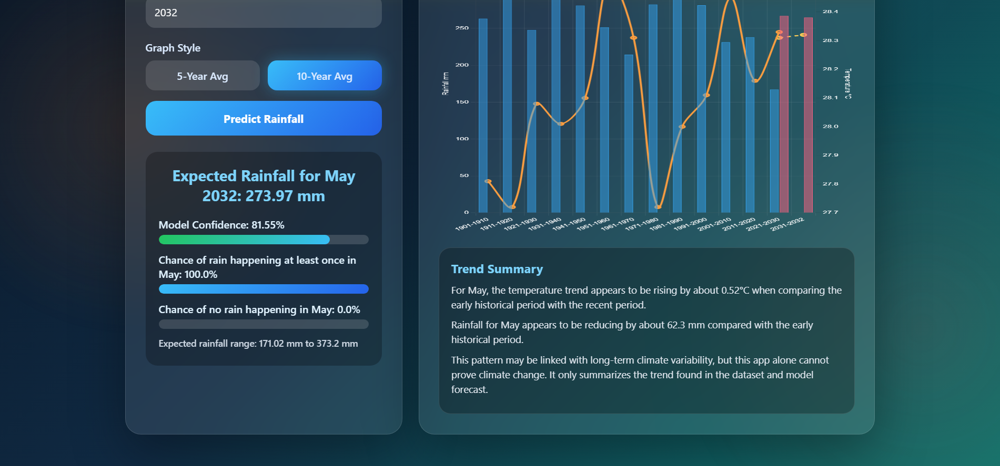

# 🌧️ Bangladesh Rainfall Predictor

An interactive Machine Learning and MLOps powered climate intelligence dashboard for forecasting monthly rainfall in Bangladesh using historical climate trends. The application combines rainfall forecasting, temperature analysis, interactive visualizations, and explainable trend summaries to support climate research and decision making.

---

## Overview

Rainfall plays a vital role in Bangladesh's agriculture, disaster preparedness, water resource management, and climate planning.

This project demonstrates how Machine Learning can be integrated into an interactive web application to forecast rainfall while comparing predictions with more than a century of historical climate observations.

Instead of producing only a single prediction, the dashboard provides historical comparisons, confidence estimates, climate trend visualization, and interpretable summaries to help users better understand long-term rainfall behavior.

---

# Live Dashboard Preview

## Main Prediction Dashboard



---

## Rainfall Forecast



---

## Historical Climate Comparison

### Historical Monthly Comparison



---

### Decade-wise Climate Comparison



---

## Features

- Interactive Streamlit dashboard
- Monthly rainfall prediction
- Historical rainfall visualization
- Historical temperature visualization
- Long-term climate comparison
- Decade-wise rainfall averaging
- Prediction confidence estimation
- Probability of rainfall occurrence
- Expected rainfall range
- Automatic trend summary generation
- User-friendly forecasting interface

---

## Project Workflow

```text
Historical Climate Dataset
            │
            ▼
Data Cleaning & Processing
            │
            ▼
Feature Engineering
            │
            ▼
Machine Learning Model
            │
            ▼
Rainfall Prediction
            │
            ▼
Confidence Estimation
            │
            ▼
Climate Trend Analysis
            │
            ▼
Interactive Streamlit Dashboard
```

---

## Dashboard Modules

### Forecast Input

Users can:

- Select month
- Select prediction year
- Choose graph style
- Generate rainfall prediction

---

### Climate Comparison

The dashboard compares

- Historical rainfall
- Historical temperature
- Predicted rainfall
- Future climate trends

allowing users to easily understand how future predictions relate to historical observations.

---

### Prediction Summary

Each prediction includes

- Expected rainfall
- Model confidence
- Rain probability
- Dry probability
- Expected rainfall range

---

### Trend Analysis

Automatically generated summaries explain

- Temperature changes
- Rainfall changes
- Historical trends
- Long-term climate observations

making results easier to interpret for non-technical users.

---

## Technologies Used

| Category | Technology |
|----------|------------|
| Programming | Python |
| Dashboard | Streamlit |
| Data Processing | Pandas, NumPy |
| Visualization | Plotly, Matplotlib |
| Machine Learning | Scikit-learn |
| Model Storage | Joblib |
| Version Control | Git & GitHub |

---

## Project Structure

```text
Bangladesh_Rainfall_Predicitor_mlops
│
├── data/
├── images/
├── models/
├── notebooks/
├── src/
├── app.py
├── requirements.txt
└── README.md
```

---

## Installation

Clone the repository

```bash
git clone https://github.com/Mashrur-Shakhawat-Sayan/Bangladesh_Rainfall_Predicitor_mlops.git
```

Move into the project directory

```bash
cd Bangladesh_Rainfall_Predicitor_mlops
```

Install dependencies

```bash
pip install -r requirements.txt
```

---

## Run the Dashboard

```bash
streamlit run app.py
```

The application will launch automatically in your web browser.

---

## Applications

This project demonstrates practical applications in

- Climate Analytics
- Rainfall Forecasting
- Agricultural Planning
- Water Resource Management
- Disaster Preparedness
- Climate Research
- Environmental Monitoring
- Educational Demonstration
- Decision Support Systems

---

## Future Improvements

Potential enhancements include

- Daily rainfall forecasting
- Regional forecasting by district
- Satellite weather integration
- Deep Learning forecasting models
- Explainable AI
- Automatic model retraining
- MLflow experiment tracking
- Docker deployment
- Cloud deployment
- REST API
- Real-time weather integration

---

## MLOps Perspective

This repository demonstrates an end-to-end machine learning application that combines data processing, model inference, visualization, and deployment through an interactive Streamlit dashboard. A production-ready MLOps workflow would further extend the project with experiment tracking, model versioning, automated deployment, and monitoring to improve reproducibility and maintainability. :contentReference[oaicite:0]{index=0}

---

## Author

**Mashrur Shakhawat Sayan**

Machine Learning • Artificial Intelligence • Data Science

GitHub

https://github.com/Mashrur-Shakhawat-Sayan

LinkedIn

https://www.linkedin.com/in/mashrur-shakhawat-0b628127a/

---

## License

This project is released for educational, research, and portfolio purposes.
